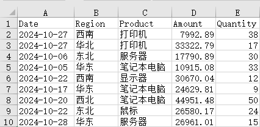
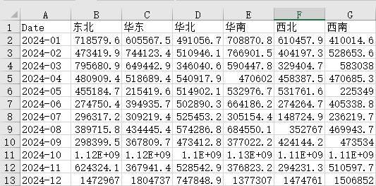

# 销售数据自动合并清洗工具

> 把十几份字段名、编码、日期格式各不相同的销售表一键合并成一张标准总表，外加月份 × 地区透视表和数据质量报告——丢了多少条数据、为什么丢，全程说得清。

## 解决什么问题

每月要汇总十几份销售表，格式各不相同：

- 格式混用：`.xlsx`、`.xls`、`.csv` 三种都有
- 字段名混乱：有的叫「销售日期」，有的叫 `date`；有的叫「销售额」，有的叫 `amount`
- 编码不统一：CSV 有 GBK 也有 UTF-8-BOM，用错编码打开直接乱码
- 日期写法：`2024年12月13日` 这种中文格式，没法直接排序和筛选
- 金额、数量列混着「暂无」「-」「N/A」等文本和空值
- 地区名带「华东（大区）」这类括号注记，同一地区被算成两个

原来要逐个文件手动对齐字段、转编码、改日期格式，费时且容易漏。
**现在一条命令自动完成，输出统一格式的总表 + 透视表 + 数据质量报告，明确告诉你哪些数据被丢弃了。**

## 什么样的数据可以直接用

**只要你的表包含下面 5 类字段（名字可以不一样），就能直接跑**：

日期、地区、产品、销售额、数量

字段名不认识也没关系——脚本内置了常见别名的自动映射（见下方表格）。
如果你的字段名不在表里，把它加进 `01_excel_merge.py` 的 `alias` 就能识别，不用改其他代码。

支持 `.xlsx` / `.xls` / `.csv` 混合放入，CSV 编码自动识别，无需指定。

## 输入 / 输出

**输入**：`dirty_data/` 下的销售表文件，支持混合编码（自动识别）。
当前示例为 14 份 2024 年销售表（12 个月的 Excel + 2 份不同编码的 CSV），另含 1 份老式 `.xls` 和 1 份 30 万行压力测试文件。

| 字段（统一后） | 类型 | 说明 | 示例值 |
|---|---|---|---|
| 日期 | 日期 | 销售日期，统一为 YYYY-MM-DD | 2024-10-27 |
| 地区 | 文本 | 销售区域 | 华北 |
| 产品 | 文本 | 产品名称 | 打印机 |
| 销售额 | 数字 | 销售金额（元） | 33322.79 |
| 数量 | 整数 | 销售数量 | 17 |

自动映射的字段别名（部分）：
- 日期 ← 销售日期 / 订单日期 / date / order_date
- 地区 ← 销售区域 / 大区 / 省份 / region / province
- 产品 ← 商品名称 / 品类 / product / sku
- 销售额 ← 销售金额 / 金额(元) / 营业额 / amount / revenue / gmv
- 数量 ← 销量 / 件数 / quantity / qty / units

**输出**（脚本同目录，每次运行覆盖）：

- `cleaned_sales_data.xlsx`
  - `明细` sheet：字段顺序统一，日期可直接排序，数量列显示整数（17 而不是 17.0）
  - `销售额透视表` sheet：月份 × 地区 的销售额汇总
- `docs/数据质量报告.txt`：读入 / 丢弃原因分布 / 输出的自洽账目





## 怎么运行

```powershell
# 1. 安装依赖
pip install -r requirements.txt

# 2. 放入数据
# 把待处理的销售表放进 dirty_data/ 目录

# 3. 运行
python 01_excel_merge.py
```

运行环境：**Python 3.9 及以上** / Windows / pandas 1.5 及以上
（本机实测环境：Python 3.14.8 + pandas 3.0.6 + openpyxl 3.1.5 + charset-normalizer 3.5.1 + xlrd 2.0.2；读取老式 `.xls` 依赖 xlrd）

运行过程中会逐步打印：空文件与损坏文件的跳过情况、日期解析失败数、金额/数量无法解析的行数、缺失剔除与去重数量，最后打印完整的数据质量报告——每一步丢了多少数据全程可见。个别损坏文件会被自动跳过并在结束时汇总，不会中断整批处理。

**实测性能**：30 万行混合数据全程约 9.6 秒（读取用 calamine、写出用 xlsxwriter 引擎；优化前 openpyxl 默认引擎约 43 秒），含清洗、透视、双 sheet 写出与质量报告。

## 数据质量说明

**（本次运行的实际数字，换成你自己的数据会变化）**

| 项目 | 数值 |
|---|---|
| 读入记录数 | 301564 |
| 清洗后记录数 | 263454 |
| 丢弃记录数 | 28110 |

**丢弃原因**

| 原因 | 条数 |
|---|---|
| 关键字段缺失（日期 / 地区 / 产品 / 销售额 / 数量任一为空或无法解析） | 37947 |
| 完全重复行（保留一条） | 163 |

参考：日期无法解析 0 条；金额无法解析 24071 条、数量无法解析 15054 条——这两类与「关键字段缺失」有重叠，缺失剔除是混合合计。

每次运行结束脚本会做**数字自洽硬校验**（输出 + 缺失剔除 + 重复剔除 = 读入），对不上会直接报错终止，不会悄悄丢数据。

**已处理的脏数据**

- [x] 字段名不一致（中英文别名统一映射，按字段名匹配、不依赖列位置）
- [x] 编码差异（GBK / UTF-8-BOM 等自动识别，中文无乱码）
- [x] 日期格式统一（`2024年12月13日` 等中文格式 → `2024-12-13`）
- [x] 数字列混入文本或空值（转数值，无法解析的置空并计数）
- [x] 关键字段缺失的行剔除（日期 / 地区 / 产品 / 销售额 / 数量）
- [x] 完全重复行去重（所有字段相同只保留一条，并输出去重数量）
- [x] 地区名称标准化（去除首尾空格、括号注记等）
- [x] 数量列输出为可空整数类型（显示 17 而不是 17.0）
- [x] 数字自洽校验（读入 = 输出 + 缺失剔除 + 重复剔除，不符即终止）
- [x] 非数据文件与 Excel 临时文件（`~$` 开头）自动跳过
- [x] 损坏或空的文件自动跳过并汇总报告，不中断整批处理

## 目录结构

```
01_excel_marge/
├── README.md
├── requirements.txt        # 依赖清单（pipreqs 生成）
├── 01_excel_merge.py       # 主脚本
├── cleaned_sales_data.xlsx # 输出结果（本地生成，不入库）
├── dirty_data/             # 输入目录（放待处理的销售表）
└── docs/
    ├── 数据质量报告.txt     # 每次运行自动更新
    ├── screenshot1.png     # 效果截图：明细表
    └── screenshot2.png     # 效果截图：销售额透视表
```

## 已知限制

- 字段别名表在 `01_excel_merge.py` 的 `alias` 中手工维护，遇到新的字段写法需补充进去
- 输出文件名固定为 `cleaned_sales_data.xlsx`，每次运行覆盖上一次结果
- 不支持带合并单元格表头的 Excel
- CSV 编码由 charset-normalizer 自动检测，极特殊情况可能误判——误判时该文件会显式报「读取失败」并列出文件名，不会静默读错
- 透视表按自然月聚合（`2024-10`），跨年数据自动按月分组

## 联系方式

有类似的数据处理需求，或想让我按你的表格格式定制，欢迎联系：

- 📮 邮箱：1182618567@qq.com
- 💬 微信：wxid_0643366417512

**我还能帮你做**
- 📊 多份 Excel 合并 / 清洗 / 透视分析
- 🤖 报表自动化：每周手动做的表，一键生成
- 🕷️ 公开数据采集（合规范围内）
- 📈 数据可视化与简报输出

**交付标准**：含数据质量报告 + 非技术人员能看懂的使用说明 + 1 个月免费 bug 修复

## 许可证

MIT License — 可自由使用和修改，保留署名即可。
